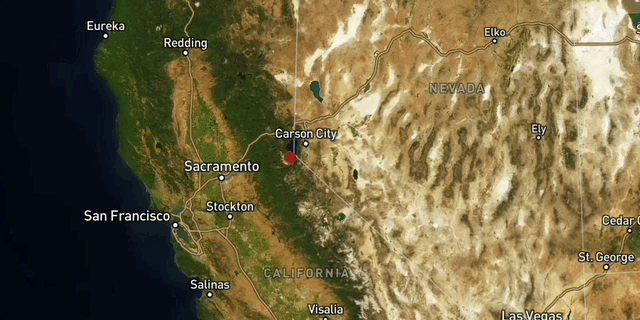

# Places I went App

## What did I build?

[places in the world] this map is about all the places ive gone too. 

Users can...
1. **Toggle through all the maps**, this app is about the places i have gone. 
1. **Explore each map** by exploring the places around the globe.
1. **See detailed itineraties** including some places around the whole globe

Here's a demo:

## Why did I build this?

I built this because I wanted people to see the places ive been to around the world. 

I set these goals for my product:

1. to see if others have gone to the same places as I
2. to see if they are interested in the same places

## Tech stack

To build this app, I used the following tools:

1. [Google Maps](https://www.google.com/maps), for generating the route lines, and exporting the geometries in `KML` format.
2. [Mapbox GL JS](https://docs.mapbox.com/mapbox-gl-js/guides) library, for styling and displaying maps and route lines, and adding camera behaviors (flyto animations).

4. [Visual Studio Code](https://code.visualstudio.com/download) free IDE, with [Live Server](https://marketplace.visualstudio.com/items?itemName=ritwickdey.LiveServer) and [Markdown All in One](https://marketplace.visualstudio.com/items?itemName=yzhang.markdown-all-in-one) extensions.
5. [GitHub pages](https://docs.github.com/en/pages/getting-started-with-github-pages/creating-a-github-pages-site), for publishing the app for free!

## Feature Spotlight

One key feature I want to spotlight is the exaggerated terrain. 

If you look closely at the map, you might notice that the hills and mountains are very dtailed, this is because I decided to go for a sattelite view of it and make it as detailed as possible.

Following the instructions of my teacher I was able to edit the style of the map and add a sattelite view of what to look at. I also had to zoom the map out a little to make sure all the markers on the map are all visible

So, why zoom the map out to 3%? Well I had to add this because if I had left the zoom default all the markers wouldnt be visible and the user would have to look through the entire map just to find a marker.

